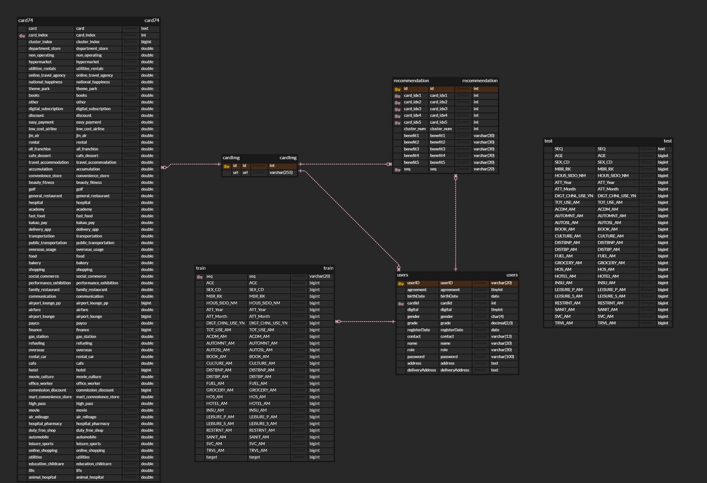
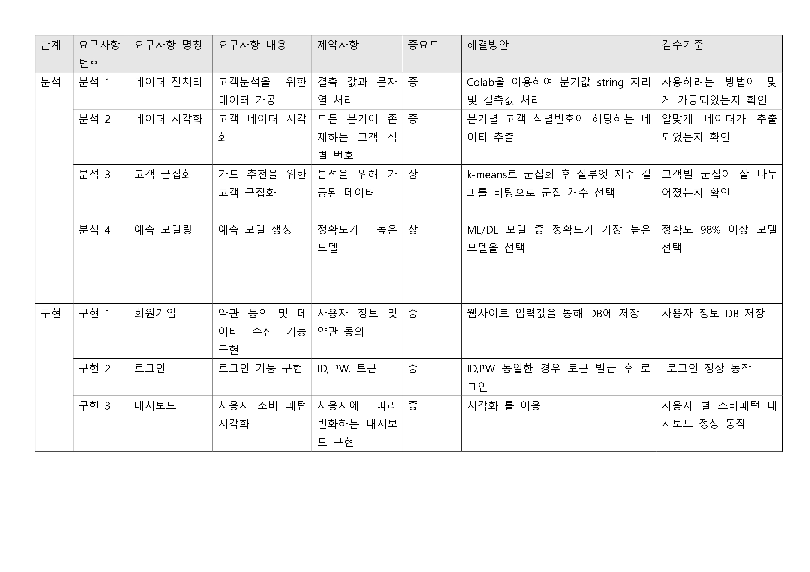
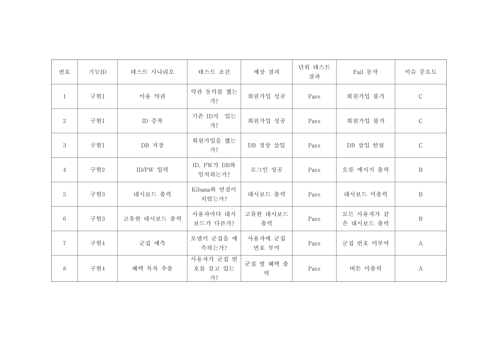
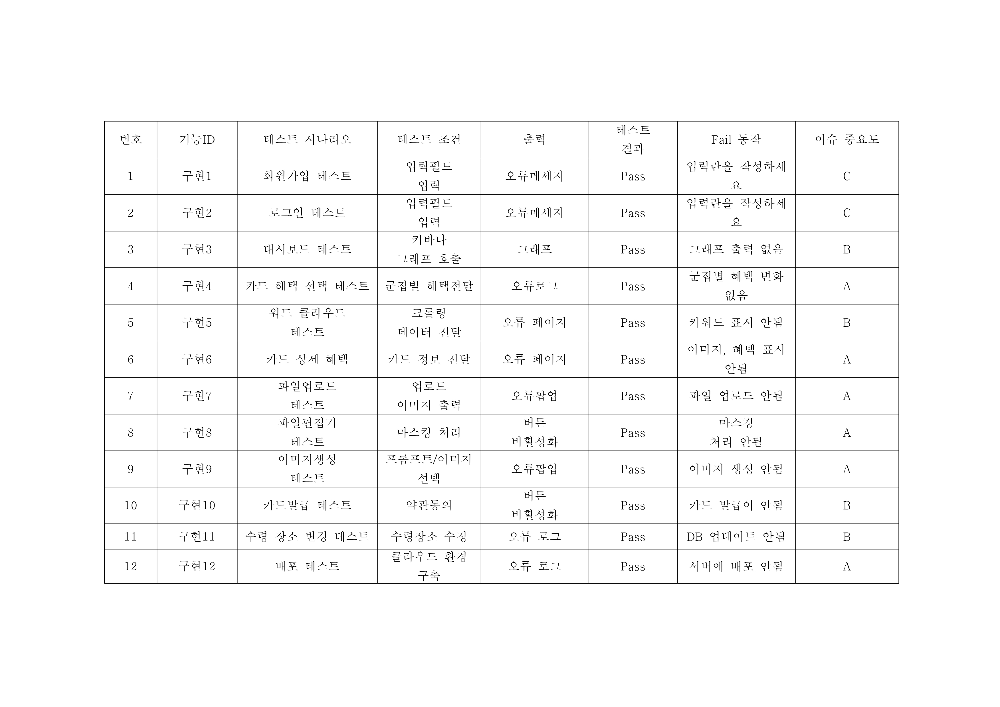
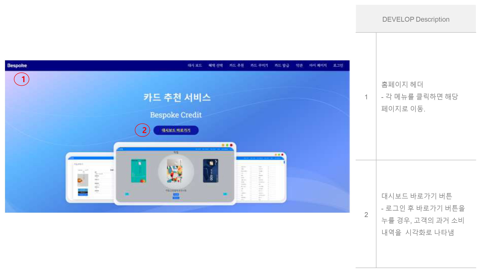
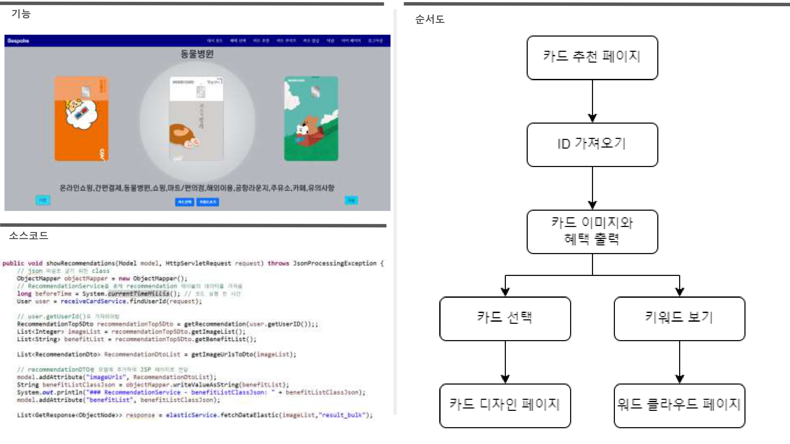

# Bespoke Card

## 1. 서비스 소개

- 고객의 데이터를 기반으로 가장 적합한 혜택을 제공하는 카드를 추천하고, DALL-E 기반의 도구를 사용하여 고객이 직접 카드의 디자인을 선택할 수 있는 서비스입니다.

## 2. 프로젝트 소개
🏆 WOORIFISA 2기 **우수 프로젝트** 🏆

- 24.03.18 ~ 24.05.14 (10주)
- 총 5명

## 3. 주요 기술

### BE

### FE

### Deploy

### Monitoring

## 4. 문서

### 시스템 아키텍쳐

### ERD diagram

### 그 외의 문서들
<!--  -->

<table>
        <tr>
            <td class="box large-box"></td>
            <td class="box small-box"><a href="https://github.com/BespokeCreditCard/SpringbootServer/tree/main/documents">요구사항 정의서</a></td>
        </tr>
        <tr>
            <td class="box large-box"></td>
            <td class="box small-box"><a href="https://github.com/BespokeCreditCard/SpringbootServer/tree/main/documents">단위테스트 산출물</a></td>
        </tr>
        <tr>
            <td class="box large-box"></td>
            <td class="box small-box"><a href="https://github.com/BespokeCreditCard/SpringbootServer/tree/main/documents">종합테스트 산출물</a></td>
        </tr>
        <tr>
            <td class="box large-box"></td>
            <td class="box small-box"><a href="https://github.com/BespokeCreditCard/SpringbootServer/tree/main/documents">사용자 인터페이스 설계</a></td>
        </tr>
        <tr>
            <td class="box large-box"></td>
            <td class="box small-box"><a href="https://github.com/BespokeCreditCard/SpringbootServer/tree/main/documents">기능구현산출물</a></td>
        </tr>
    </table>
    </table>